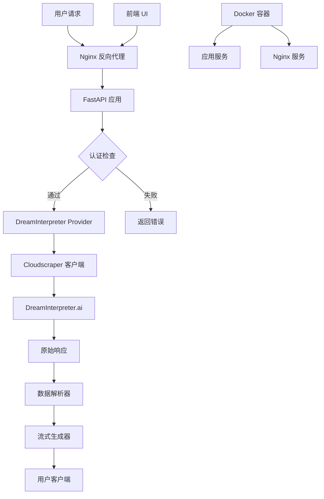

# 🔮 DreamInterpreter-2API: 你的私人AI解梦大师


**仓库链接: [GitHub - dreaminterpreter-2api](https://github.com/lzA6/dreaminterpreter-2api)**

> "我们是由梦构成的，我们短暂的一生，前后都环绕在沉睡之中。" — 莎士比亚《暴风雨》

欢迎来到 `dreaminterpreter-2api` 的世界！这是一个充满魔法 ✨ 的项目，它将 [DreamInterpreter.ai](https://dreaminterpreter.ai/) 网站强大的解梦能力，封装成了一个与 OpenAI API 格式完全兼容的高性能服务。

这意味着，你现在可以像调用 GPT-4 一样，通过简单的 API 请求，去探索你那光怪陆离的梦境世界了！🧠

---

## 🌟 项目核心特性

- **🚀 OpenAI 兼容**: 无缝对接任何支持 OpenAI API 格式的客户端、应用和工作流
- **📦 一键部署**: 提供 Docker Compose 配置，轻松完成部署
- **🛡️ 智能防护**: 内置 `cloudscraper`，自动处理 Cloudflare 的 JavaScript 和 reCAPTCHA 挑战
- **⚡ 高性能**: 基于 FastAPI 构建，异步处理，性能卓越
- **🌐 伪流式输出**: 将完整的解梦结果模拟成打字机效果的流式响应
- **🎨 自带 UI**: 提供简洁美观的前端测试页面，开箱即用
- **🔐 安全可靠**: 支持 API Key 认证，保护服务安全

---

## 📜 项目的哲学与价值观

在这个快节奏的时代，我们常常忽略了内心的声音，而梦境正是潜意识写给我们最私密、最真诚的信。`dreaminterpreter-2api` 的诞生，源于一个简单的信念：**技术应该是连接我们与内心世界的桥梁，而不是冰冷的机器**。

### 我们的核心价值

1. **赋能个体**: 每个人都应该拥有探索自我、理解梦境的工具
2. **拥抱开源**: 将代码、思路、经验完全公开，激发社区创造力
3. **追求优雅**: 在代码结构和 API 设计中追求简洁与美感
4. **保持谦逊**: 坦诚面对项目不足，与社区共同成长

---

## 🏗️ 系统架构



---

## 📂 项目文件结构

```
dreaminterpreter-2api/
├── .env                    # 环境配置文件
├── .env.example           # 环境配置模板
├── Dockerfile             # 应用 Dockerfile
├── docker-compose.yml     # Docker 编排文件
├── main.py                # FastAPI 应用入口
├── nginx.conf             # Nginx 配置
├── requirements.txt       # Python 依赖
└── app/
    ├── core/
    │   ├── __init__.py
    │   └── config.py      # 配置管理
    ├── providers/
    │   ├── __init__.py
    │   ├── base_provider.py    # Provider 抽象基类
    │   └── dreaminterpreter_provider.py  # 核心逻辑
    └── utils/
        ├── __init__.py
        └── sse_utils.py   # SSE 工具函数
└── static/
    ├── index.html         # 前端页面
    ├── script.js          # 前端逻辑
    └── style.css          # 前端样式
```

---

## 🛠️ 技术实现深度解析

### 1. 核心工作原理

整个系统的工作流程就像一场精心策划的特工行动：

1. **伪装身份**: 使用精心构造的 HTTP 头信息模拟真实浏览器
2. **突破防护**: 通过 `cloudscraper` 绕过 Cloudflare 的安全检测
3. **数据获取**: 向目标网站发送格式化的梦境解析请求
4. **信息提取**: 从复杂的响应数据中精准提取解梦内容
5. **流式返回**: 将完整结果模拟成实时生成的流式响应

### 2. 技术栈深度分析

| 技术组件 | 核心用途 | 技术解读 | 实现难度 | 推荐指数 |
|---------|---------|---------|---------|---------|
| **FastAPI** | API 服务框架 | 现代高性能 Python Web 框架，基于类型注解 | ★★☆☆☆ | ★★★★★ |
| **Docker** | 应用容器化 | 应用打包和部署的标准化解决方案 | ★★★☆☆ | ★★★★★ |
| **Cloudscraper** | 反爬虫绕过 | 模拟真实浏览器行为，突破 Cloudflare 防护 | ★★★★☆ | ★★★★★ |
| **Nginx** | 反向代理 | 高性能 Web 服务器，提供负载均衡和静态文件服务 | ★★★☆☆ | ★★★★☆ |
| **Pydantic** | 数据验证 | 基于 Python 类型提示的数据验证和配置管理 | ★★☆☆☆ | ★★★★★ |

### 3. 核心算法解析

#### 数据提取算法 (Next.js RSC Payload 解析)

```python
def _parse_response(response_text: str) -> Dict[str, str]:
    """
    从 Next.js RSC 响应中提取结构化数据
    
    算法步骤:
    1. 定位 JSON 数据块起始位置
    2. 提取并解析 JSON 数据
    3. 递归搜索目标字段
    4. 编码修复和内容清理
    """
    # 实现细节...
```

#### 流式生成算法

```python
async def stream_generator(complete_text: str) -> AsyncGenerator[str, None]:
    """
    将完整文本转换为伪流式输出
    
    参数:
        complete_text: 完整的解梦文本
        
    生成器:
        模拟实时生成的文本块
    """
    chunk_size = 10
    for i in range(0, len(complete_text), chunk_size):
        chunk = complete_text[i:i + chunk_size]
        yield chunk
        await asyncio.sleep(0.02)  # 模拟思考延迟
```

---

## 🚀 快速开始

### 环境要求

- Docker & Docker Compose
- 有效的 DreamInterpreter.ai 账户

### 部署步骤

#### 第 1 步：获取项目代码

```bash
git clone https://github.com/lzA6/dreaminterpreter-2api.git
cd dreaminterpreter-2api
```

#### 第 2 步：配置环境变量

1. **复制环境模板**:
```bash
cp .env.example .env
```

2. **获取认证 Cookie**:
   - 登录 [DreamInterpreter.ai](https://dreaminterpreter.ai/)
   - 打开浏览器开发者工具 (F12)
   - 切换到 Network 标签页
   - 执行一次解梦操作
   - 复制请求头中的 Cookie 值

3. **配置环境变量**:
```env
# API 安全密钥
API_MASTER_KEY=your-secret-key-here

# 服务端口
NGINX_PORT=8090

# DreamInterpreter 认证信息
DREAMINTERPRETER_COOKIE="your-cookie-value-here"
```

**重要提示**: 如果 Cookie 中包含 `$` 符号，请替换为 `$$`

#### 第 3 步：启动服务

```bash
docker-compose up -d
```

服务启动后，访问 http://localhost:8090 即可使用测试界面。

---

## 🎯 API 使用指南

### 基础请求示例

```bash
curl -X POST "http://localhost:8090/v1/chat/completions" \
  -H "Content-Type: application/json" \
  -H "Authorization: Bearer your-api-key" \
  -d '{
    "model": "dream-interpreter-pro",
    "messages": [
      {
        "role": "user", 
        "content": "我梦见自己在一片无尽的星空下飞翔，感觉非常自由。"
      }
    ],
    "stream": true
  }'
```

### 流式响应示例

```json
{
  "id": "chatcmpl-random-id",
  "object": "chat.completion.chunk", 
  "created": 1760801645,
  "model": "dream-interpreter-pro",
  "choices": [
    {
      "index": 0,
      "delta": {
        "content": "## 飞翔的梦\n\n在无尽的星空下..."
      },
      "finish_reason": null
    }
  ]
}
```

### 集成示例

#### Python 客户端

```python
import openai

client = openai.OpenAI(
    base_url="http://localhost:8090/v1",
    api_key="your-api-key"
)

response = client.chat.completions.create(
    model="dream-interpreter-pro",
    messages=[
        {"role": "user", "content": "你的梦境描述..."}
    ],
    stream=True
)

for chunk in response:
    if chunk.choices[0].delta.content:
        print(chunk.choices[0].delta.content, end="")
```

---

## 🗺️ 项目现状与未来发展

### ✅ 已完成功能

- [x] 完整的解梦 API 服务
- [x] OpenAI API 格式兼容
- [x] Docker 容器化部署
- [x] 前端测试界面
- [x] 流式响应支持
- [x] 基础错误处理

### 🚧 已知限制

1. **单点依赖**: 仅依赖 DreamInterpreter.ai 作为数据源
2. **认证维护**: 需要手动维护 Cookie 认证
3. **错误处理**: 对上游服务异常的容错能力有限
4. **性能限制**: 缺乏请求队列和缓存机制

### 🎯 未来发展路线图

#### 短期目标 (v1.1)
- [ ] 多数据源支持架构
- [ ] 基础缓存机制
- [ ] 改进的错误处理

#### 中期目标 (v1.5)  
- [ ] 自动 Cookie 刷新机制
- [ ] 请求频率限制
- [ ] 监控和日志增强

#### 长期愿景 (v2.0)
- [ ] 多 Provider 插件系统
- [ ] 分布式缓存支持
- [ ] 完整的监控仪表板

---

## 🤝 贡献指南

我们欢迎各种形式的贡献！无论是代码改进、文档完善还是新功能建议。

### 开发环境设置

1. **克隆项目**:
```bash
git clone https://github.com/lzA6/dreaminterpreter-2api.git
cd dreaminterpreter-2api
```

2. **安装依赖**:
```bash
pip install -r requirements.txt
```

3. **环境配置**:
```bash
cp .env.example .env
# 编辑 .env 文件配置相应参数
```

4. **启动开发服务**:
```bash
python main.py
```

### 贡献流程

1. Fork 本仓库
2. 创建功能分支 (`git checkout -b feature/AmazingFeature`)
3. 提交更改 (`git commit -m 'Add some AmazingFeature'`)
4. 推送到分支 (`git push origin feature/AmazingFeature`)
5. 创建 Pull Request

### 代码规范

- 遵循 PEP 8 Python 代码规范
- 为新增功能添加适当的单元测试
- 更新相关文档
- 确保 Docker 构建正常

---

## 📄 许可证

本项目采用 Apache 2.0 许可证 - 详见 [LICENSE](LICENSE) 文件。

---

## 🙏 致谢

感谢所有为这个项目做出贡献的开发者，以及 DreamInterpreter.ai 提供的优质服务。

**让我们一起，用代码编织更美的梦。** ✨

---
